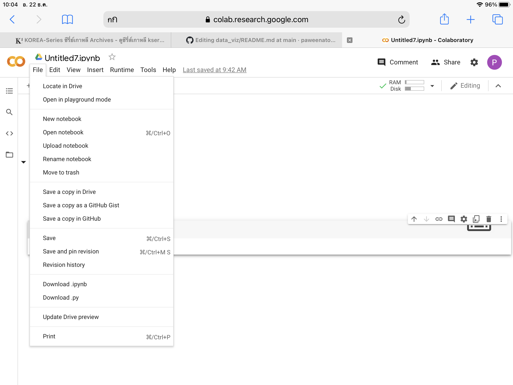

# data_viz

ปวีณา ตรีทศ 613021095-3

ตัวอย่างการแทรกรูป

![ชื่อไฟล์ในgithub]วงเล็บเปิด ชื่อรูป วงเล็บปิด

ขั้นตอนการ Save ไฟล์จาก Colab มา Github
1.เข้าระบบไว้ทั้ง 2 เว็บ ทั้ง github,colab เพื่อให้ทั้งสองเว็บลิงค์กันได้
2.หลังจากเขียนโค้ดบน colab เสร็จแล้ว ให้ไปคลิกที่ File จากนั้นคลิก Save a copy in GitHub

3.จากนั้นจะขึ้นหน้าต่างดังรูป ให้แก้ไขชื่อไฟล์ที่ File path และใส่คำอธิบายว่าแก้ไขหรือทำอะไรไปบ้างที่ Commit message จากนั้นคลิก OK จากนั้น Colab จะ save file ไปยัง github
